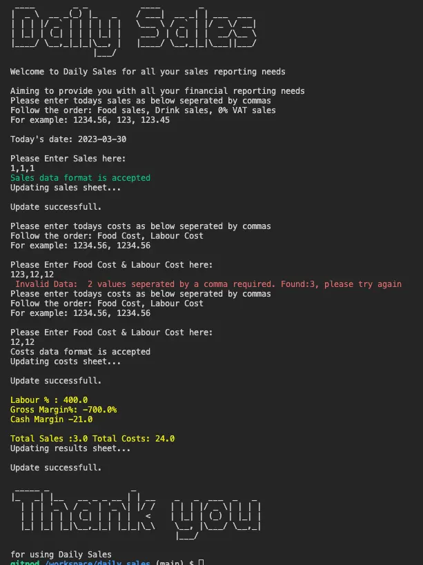
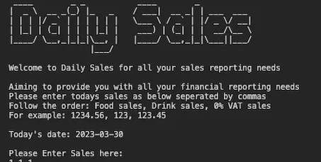
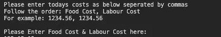
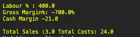
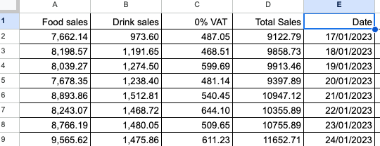
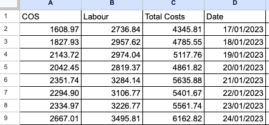

# Daily Sales

### [Visit Live Site](https://daily-sales.herokuapp.com/) / [Visit Repository](https://github.com/JonnyDavison/daily_sales)

Daily Sales is a Code Institute Full-stack development program project built in Python. Made with the food indusrty in particular independant restaurants and food stores in mind. Providing a quick and simple analysis to track daily trends and store these in google sheets to refeclt on over time. 

Visit the live site Here.
(link)

[Back to top ⇧](#daily-sales)
## CONTENTS

 - [Project Overview](#project-overview)
    - [Project Goals](#project-goals)
- [User Experience](#user-experience)
    - [User Expectations](#user-expectations)
    - [User Stories](#user-stories)
- [Design](#design)
    - [Colour Scheme & Styling](#colour-scheme--styling)
    - [Structure](#structure)
    - [Flow chart](#daily-sales-logic-flow-chart)
- [Features](#features)
    - [Intro](#intro-and-sales-input)
    - [Custom Error Handling](#custom-error-handling)
    - [Cost Input](#cost-input)
    - [Calculation Values](#calculation-values)
- [Future Implementations](#future-implementations)
- [Technologies Used](#technologies-used)
    - [Languages Used](#languages-used)
    - [Programs Used](#programs-used)
- [Deployment](#deployment)
- [Testing](#testing)
- [Credits](#credits)
    - [Code used and adapted](#code-used-and-adapted)
    - [Websites Used to gather information](#websites-visited-to-gather-information)

## Project Overview
Developing 'Daily Sales' has been a been a long time coming from the authors previous career. This daily analysis is essential to the succeful running of small and medium food buisness, where this information is key to decission making ahead of the following day. The development process included, reserach, indusrty knowlege and followed a logic flowchart. There are built in features to assit and guide the user throught the program:

- Error handeling to validate user input
- User feedback on the input (Custom ValueError messages)
- Text spacing for user readability 
- Useful information passed back quickly to the user
- Information stored in order to provide accounts for review

The project also uses Google Worksheet API for:
- Inputing and storing Data 
- Sales, Costs & Results pages to store financial data
- Pulling data for calulation
- Storing the calulation results
- Providing the user with a large data set

This is the [Google worksheet](https://docs.google.com/spreadsheets/d/1NckZYPLVFrlbqXG2FIFwfhZlNg0fQ67WtQURLmhWKC8/edit?usp=sharing) used to hold the data

## Project Goals
- Develop CLI based Sales analysis application using Python
- Request and present information in a clear and easy to understand manner
- Keep good UX principles regarding layout and interaction
- Robust Python code without issues/bugs

[Back to top ⇧](#daily-sales)

## User Experience
### User Expectations
- Able to quickly understand what the app is for
- Provide additional information directing the user 
- Iteractions have feedback
- Provide format instructions to assit in gathering the correct data
- No logic errors

### User Stories
- I want to know what is this site for
- I want to know what information to provide
- I want to store my information
- I want to get feedback on my interactions
- I want to get relavant information returned to me
- I want no bugs or issues in the program
[Back to top ⇧](#daily-sales)

## Design
### Colour Scheme & Styling
In order to imporve the UX and readibility both Pyfiglet and Colorama where imported. Pyfiglet allows large text to be displayed for the 'logo'. Colorama provides text colour highlighting essential information for the user. the colours used are inline with usual expectioans
- Red for an input error
- Green for accepted values
- Yellow to highlight the results the user returned.

### Structure
#### Daily Sales Logic Flow Chart

The flowchart was designed at the start of the project to map out the logic path. The final result remained fairly close to the flowchart.

[Back to top ⇧](#daily-sales)

## Features
### Intro and Sales Input

### Custom Error handling 

### Cost Input

### Calculation Values

## Google Sheets
Google sheets is used to store and recall the data, giving the user the ability to save daily accounts and store them

Sales Sheet

Costs Sheet

Results sheet

## Future Implementations
The next versions of Daily Sales would see the development of further analysis being provided to the user. Taking in and storing of more in-depth data set, adding more detailed breakdown of the analysis. It would also be beneificial to the user to be able to run reports over mulitple days or in set patterns in order to understand sales trends. 

[Back to top ⇧](#daily-sales)

## Technologies Used
### Languages Used
PYTHON - The project logic and operations inside CLI were developed using Python.

### Programs Used
- GitHub - Source code hosted on GitHub, deployed using Git Pages.
- GitPod - Used to commit, comment and push code during the development process.
- LanguageTool - Used to spell-check the contents of README.md
- Heroku - used to deploy the project
- Google worksheet - used to host the worksheet to hold data
- Lucidchart - used to make the flowchart for the project

### Libraries used
- Pyfiglet - Used to add large text
- Colorama - Bringing some color to the project
- Datetime - Used to get the current time

[Back to top ⇧](#daily-sales)

## Deployment
The project was written and hosted on GitHub. The GitHub terminal was used in the early deveopment stages with command 'python3 run.py' to run and test the programe logic. After development had reached the later stages it was deployed on Heroku using the following method:

- Add dependencies in GitPod to requirements.txt file with command "pip3 freeze > requirements.txt"
- Commit and push to GitHub
- Go to the Heroku Dashboard
- Click "Create new app"
- Name app and select location
- Add Config Vars for Creds and Port in Settings tab
- Add the buildbacks to Python and NodeJS in that order
- Select appropriate deployment method, GitHub
- Connect to Github and link to repository
- Enable automatic deployment and/or deploy manually
- Click on Deploy
[Back to top ⇧](#daily-sales)

## Testing
In respose to User stories.
- I want to know what is this site for
    - Upon loading the logo, and instructions explain what the program does
- I want to know what information to provide
    - It requests specifc information from the user and explains what format to provide it in
- I want to store my information
    - The connected Google Sheet stores and records the data
- I want to get feedback on my interactions
    - Throught out the programe there is guidence before and a respose to inputs provided
- I want to get relavant information returned to me
    - Information that is usseful in the day-to-day management of the buisness is returned to the user. This could be made bespoke should other information be required
- I want no bugs or issues in the program
    - Error messages loop to the request of the information until correct data is provided. At this time the author is unaware of any ways a 'normal' user could 'break' the program

### Manual Testing   
Manual testing was carried out throughout the development of each element in the program, running the parts individually and together. This was done through the GitPod terminal. After the project was depolyed to Heroku further manual testing was carried out. 

## Bugs
As project was built there was many bugs during the development porcess, many of these where resolved quickly through reserach the relevant documentation, stackoverflow and W3Schools

2 Bugs of note:

- Validation errors with the return of strings and floats, this was resolved by returnong to the Code Institute LMS and following throught the learning material in order to find specifc information

- Updating multipule strings to the sheet and returning the values. This required deep dive throught
 the gspread documnetation, updateing of teh code and formating of the sheet to return values that could be read correectly.

[Back to top ⇧](#daily-sales)

## Credits
### Code used and adapted
- Using Google worksheet to store data the starting point of this was taken from Code Institute [Love Sandwiches project.](https://github.com/Code-Institute-Solutions/love-sandwiches-p5-sourcecode) 
- Code Institute Python Essentials template was provided for use and is avaiable [here](https://github.com/Code-Institute-Org/python-essentials-template).

### Websites visited to gather information
There were many sites visited during the duration of the project. 
- Google 
- Stack Overflow
- W3Schools

[Back to top ⇧](#daily-sales)