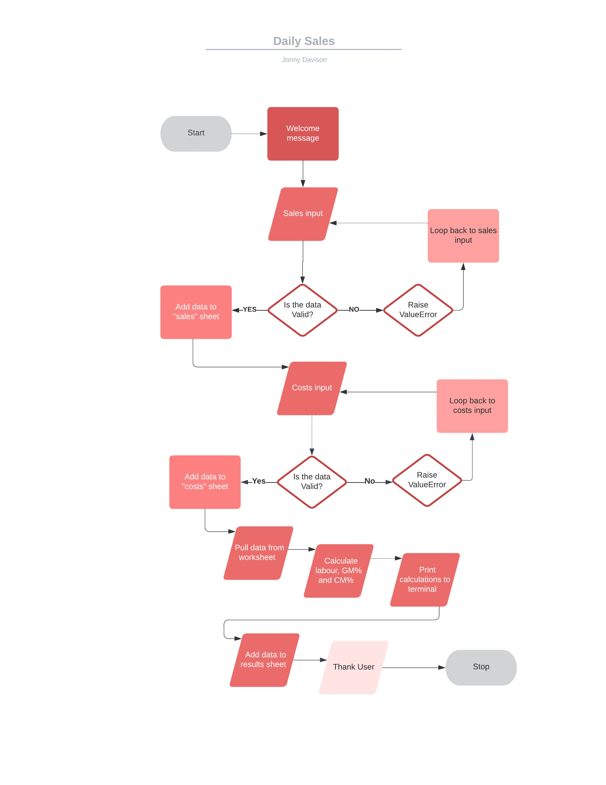
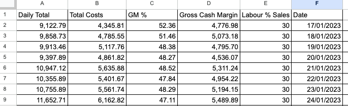

# Daily Sales

### [Visit Live Site](https://daily-sales.herokuapp.com/) / [Visit Repository](https://github.com/JonnyDavison/daily_sales)

Daily Sales is a Code Institute Full-stack development program project built in Python. Made with the food industry, in particular independent restaurants and food stores, in mind. Providing a quick and simple analysis to track daily trends and store these in google sheets to reflect on over time. 

[Back to top ⇧](#daily-sales)
## CONTENTS
 - [Project Overview](#project-overview)
    - [Project Goals](#project-goals)
- [User Experience](#user-experience)
    - [User Expectations](#user-expectations)
    - [User Stories](#user-stories)
- [Design](#design)
    - [Colour Scheme & Styling](#colour-scheme--styling)
    - [Structure](#structure)
    - [Flow chart](#daily-sales-logic-flow-chart)
- [Features](#features)
    - [Intro](#intro-and-sales-input)
    - [Custom Error Handling](#custom-error-handling)
    - [Cost Input](#cost-input)
    - [Calculation Values](#calculation-values)
- [Future Implementations](#future-implementations)
- [Technologies Used](#technologies-used)
    - [Languages Used](#languages-used)
    - [Programs Used](#programs-used)
- [Deployment](#deployment)
- [Testing](#testing)
- [Credits](#credits)
    - [Code used and adapted](#code-used-and-adapted)
    - [Websites Used to gather information](#websites-visited-to-gather-information)

## Project Overview
Developing 'Daily Sales' has been a long time coming from the author's previous career. This daily analysis is essential to the successful running of small and medium food business, where this information is key to decision making ahead of the following day. The development process included, research, industry knowledge and followed a logic flowchart. There are built in features to assist and guide the user through the program:

- Error handling to validate user input
- User feedback on the input (Custom ValueError messages)
- Text spacing for user readability 
- Useful information passed back quickly to the user
- Information stored in order to provide accounts for review

The project also uses Google Worksheet API for:
- Inputting and storing Data 
- Sales, Costs & Results pages to store financial data
- Pulling data for calculation
- Storing the calculation results
- Providing the user with a large data set

This is the [Google worksheet](https://docs.google.com/spreadsheets/d/1NckZYPLVFrlbqXG2FIFwfhZlNg0fQ67WtQURLmhWKC8/edit?usp=sharing) used to hold the data

## Project Goals
- Develop CLI based Sales analysis application using Python
- Request and present information in a clear and easy to understand manner
- Keep good UX principles regarding layout and interaction
- Robust Python code without issues/bugs

[Back to top ⇧](#daily-sales)

## User Experience
### User Expectations
- Able to quickly understand what the app is for
- Provide additional information directing the user 
- Interactions have feedback
- Provide format instructions to assist in gathering the correct data
- No logic errors

### User Stories
- I want to know what is this site for
- I want to know what information to provide
- I want to store my information
- I want to get feedback on my interactions
- I want to get relevant information returned to me
- I want no bugs or issues in the program

[Back to top ⇧](#daily-sales)

## Design
### Colour Scheme & Styling
In order to improve the UX and readability, both Pyfiglet and Colorama were imported. Pyfiglet allows large text to be displayed for the 'logo'. Colorama provides text colour highlighting essential information for the user. The colours used are inline with usual exceptions
- Red for an input error
- Green for accepted values
- Yellow to highlight the results the user returned.

### Structure
#### Daily Sales Logic Flow Chart

The flowchart was designed at the start of the project to map out the logic path. The final result remained fairly close to the flowchart.

[Back to top ⇧](#daily-sales)

## Features
### Intro and Sales Input

### Custom Error handling 

### Cost Input

### Calculation Values

## Google Sheets
Google sheets are used to store and recall the data, giving the user the ability to save daily accounts and store them

Sales Sheet

Costs Sheet

Results sheet

## Future Implementations
The next versions of Daily Sales would see the development of further analysis being provided to the user. Taking in and storing of more in-depth data set, adding more detailed breakdown of the analysis. It would also be beneficial to the user to be able to run reports over multiple days or in set patterns in order to understand sales trends. 

[Back to top ⇧](#daily-sales)

## Technologies Used
### Languages Used
PYTHON - The project logic and operations inside CLI were developed using Python.

### Programs Used
- GitHub - Source code hosted on GitHub, deployed using Git Pages.
- GitPod - Used to commit, comment and push code during the development process.
- LanguageTool - Used to spell-check the contents of README.md
- Heroku - used to deploy the project
- Google worksheet - used to host the worksheet to hold data
- Lucidchart - used to make the flowchart for the project

### Libraries used
- Pyfiglet - Used to add large text
- Colorama - Bringing some color to the project
- Datetime - Used to get the current time

[Back to top ⇧](#daily-sales)

## Deployment
The project was written and hosted on GitHub. The GitHub terminal was used in the early development stages with command 'python3 run.py' to run and test the program logic. After development had reached the later stages, it was deployed on Heroku using the following method:

- Add dependencies in GitPod to requirements.txt file with command "pip3 freeze > requirements.txt"
- Commit and push to GitHub
- Go to the Heroku Dashboard
- Click "Create new app"
- Name app and select location
- Add Config Vars for Creds and Port in Settings tab
- Add the build packs to Python and NodeJS in that order
- Select appropriate deployment method, GitHub
- Connect to Github and link to repository
- Enable automatic deployment and/or deploy manually
- Click on Deploy
[Back to top ⇧](#daily-sales)

## Testing
In response to User stories.
- I want to know what is this site for
    - Upon loading the logo, and instructions explain what the program does
- I want to know what information to provide
    - It requests specific information from the user and explains what format to provide it in
- I want to store my information
    - The connected Google Sheet stores and records the data
- I want to get feedback on my interactions
    - Throughout the program there is guidance before and a response to inputs provided
- I want to get relevant information returned to me
    - Information that is useful in the day-to-day management of the business is returned to the user. This could be made bespoke should other information be required
- I want no bugs or issues in the program
    - Error messages loop to the request of the information until correct data is provided. At this time, the author is unaware of any ways a 'normal' user could 'break' the program

### Manual Testing   
Manual testing was carried out throughout the development of each element in the program, running the parts individually and together. This was done through the GitPod terminal. After the project was deployed to Heroku further manual testing was carried out. 

### Automated Testing
[Code Institute Python Linter](https://pep8ci.herokuapp.com/)
This returned no errors after completing the code base at the submission phase.

## Bugs
As the project was built there were many bugs during the development process, many of these were resolved quickly through research of the relevant documentation, Stack Overflow and W3Schools

2 Bugs of note:

- Validation errors with the return of strings and floats, this was resolved by studying the Code Institute LMS and following through the learning material in order to find specific information

- Updating multiple strings to the sheet and returning the values. This required a deep dive through the gspread documentation, updating of the code and formatting of the sheet to return values that could be read correctly.

[Back to top ⇧](#daily-sales)

## Credits
### Code used and adapted
- [Love Sandwiches project.](https://github.com/Code-Institute-Solutions/love-sandwiches-p5-sourcecode) Using Google worksheet to store data, the starting point of this was taken from Code Institute 
- [Code Institute Python Essentials template](https://github.com/Code-Institute-Org/python-essentials-template) was provided to start the project.

### Websites visited to gather information
There were many sites visited during the duration of the project. 
- [Google](https://google.com/)
- [Stack Overflow](https://stackoverflow.com/)
- [W3Schools](https://www.w3schools.com/python/default.asp)
- [PEP8](https://peps.python.org/pep-0008/)
- [Code Institute LMS](https://learn.codeinstitute.net/)

[Back to top ⇧](#daily-sales)